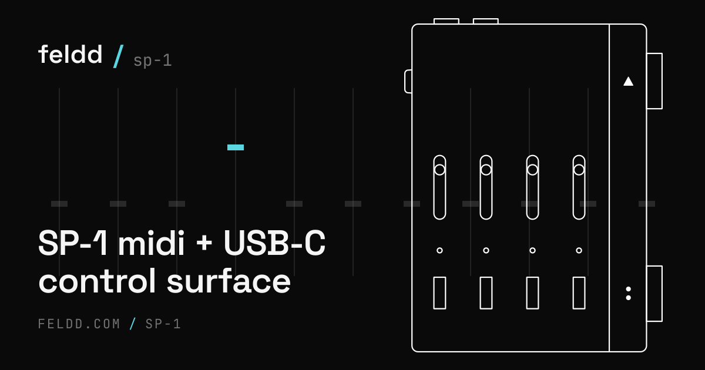

# feldd

**feldd turns the Teenage Engineering SP-1 into a configurable MIDI and keyboard controller. Its 4 faders and 9 buttons become fully remappable over USB and 3.5 mm TRS MIDI, set up entirely from your browser.**

> The SP-1 is an unreleased TE device. This is unofficial community firmware, not affiliated with or endorsed by Teenage Engineering.

**Latest firmware: v0.23.0 (stable)**, plus **v0.24.0-beta** (get both at [feldd.com](https://feldd.com)).

**New in 0.24.0-beta:** MIDI clock, the SP-1 can be a clock master, set tempo by tap or fader, or pass clock through, and PLAY is now a normal mappable button.

## What it does

- 🎛️ **4 faders + 9 buttons → MIDI**, map any control to any CC or note, each on its own channel; a button can also send a value you pick (set-on-press, momentary, or toggle)
- ⌨️ **Keyboard mode**, buttons can type keys and shortcuts (Cmd+C, Cmd+Z) so it drives any app, not just music software
- 🎵 **Chords + note-sets on any button**, build a chord per button as a hand-picked set, a root and quality, or a range for an M8 cluster, one press fires the whole set
- 🪜 **8 layers per profile**, hold PLAY to shift to a layer you pick (the side light follows), or flip PLAY to a normal mappable button
- 💾 **8 profiles per mode on the device**, step them live with •• + Vol, no computer needed
- 🎚️ **•• is the function button**, hold it and tap a control to step layers or profiles, flip MIDI/Keyboard mode, or reach the utility row (battery, LED brightness, MIDI panic); hold •• to peek your profile
- 🏷️ **Name your controls**, per-control labels save with your .feldd file so a shared profile explains itself
- 🎹 **USB-MIDI 1.0 + TRS (3.5 mm) MIDI** out, drives your DAW or your hardware
- 🔌 **Configure live in the browser**, read, edit, write, and watch your controls move in real time over USB

## Use it, all in the browser, no app to install

### → **[feldd.com](https://feldd.com)**

- **[Configure your SP-1](https://feldd.com/sp-1/configure)**, map the faders + buttons, manage your 8 profiles, and watch them fire live. *(Chromium browser, uses WebSerial.)*
- **[Flash the firmware](https://feldd.com/sp-1/flash)**, a guided walkthrough using the community **Solderless** tool.

Flash once, then configure and reconfigure from the browser whenever you like.

## 🤖 Claude Code console (feldd-cc)

Turn the SP-1 into a physical console for **Claude Code**: the track lights show when an agent is
working / needs you / done, and the buttons drive the session (Play = approve, rocker = scroll). It's
a small local daemon plus Claude Code hooks, talking to feldd's `led` verb (shipped in 0.16.0-beta)
and its button monitor stream over USB. Setup is itself a Claude Code task — point your agent at
[`feldd-cc/`](feldd-cc) and have it follow [`feldd-cc/SETUP.md`](feldd-cc/SETUP.md). The led verb +
monitor stream are hardware-validated.

## ⚠️ Flashing safety

You're modifying an irreplaceable device. feldd links above the TE bootloader (`0x20000`) and keeps the Track 1 + 4 DFU escape hatch plus a charge-standby gate, so a bad flash is recoverable by re-flashing the known-good `sp1_looper.bin`. Read the warnings on the [flash page](https://feldd.com/sp-1/flash) before you start.

---

## Building from source

> Most people never need this, just use **[feldd.com](https://feldd.com)**. This section is for developers who want to build or fork the firmware.

feldd is a Zephyr / nRF Connect SDK app for the nRF52840 inside the SP-1.

- Set up the toolchain + west workspace: `scripts/setup-zephyr-ws.sh`
- Get the **`sp1` board definition** from the **marisko** project and point `BOARD_ROOT` (in `scripts/fw.sh`) at it
- Build: `scripts/fw.sh build` · flashable image: `scripts/fw.sh bin` · vector-table/size check: `scripts/fw.sh info`
- `scripts/sp1ctl.py`, host CLI for the JSON-lines config protocol; `firmware/test/`, pure-logic tests (`cd firmware/test && make`)
- Protocol + packed profile format: `scripts/sp1-profile-format.md`

## Credits

- **[Solderless](https://solderless.engineering)**, the flash + stem-loader tools that make SP-1 hacking possible
- **[Tim Knapen / SP-1-dev](https://github.com/timknapen/SP-1-dev)**, SP-1 developer docs + wiki
- **marisko**, the `sp1` Zephyr board definition
- **Eric Lewis / sp1-midi**, gold-standard nRF52 BSP + boot-safety reference

## License

MIT, see [`LICENSE`](LICENSE). Dependencies (Zephyr, the board definition, etc.) under their own licenses.
